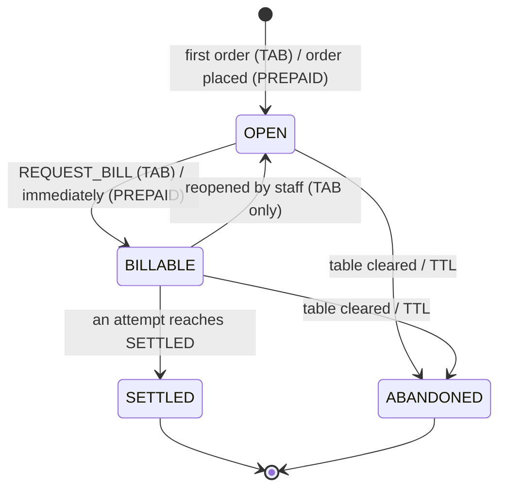
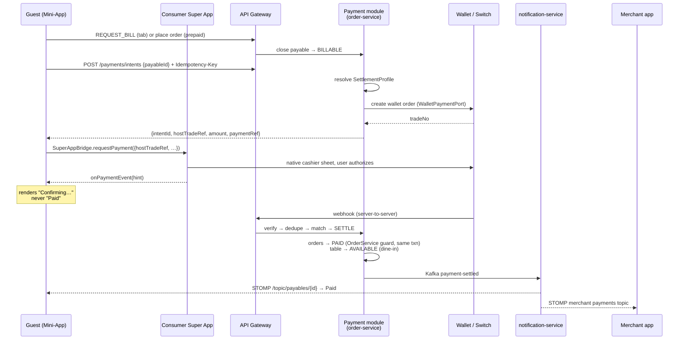
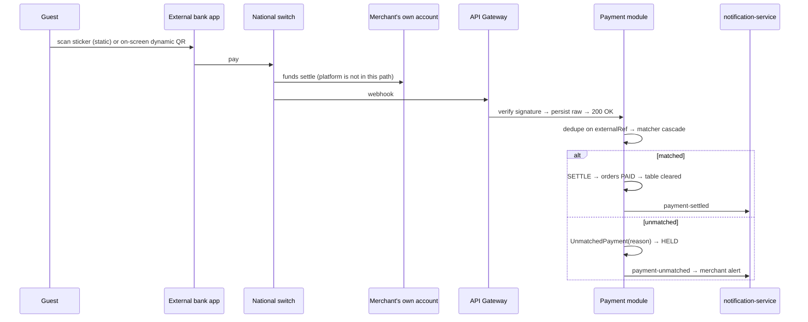
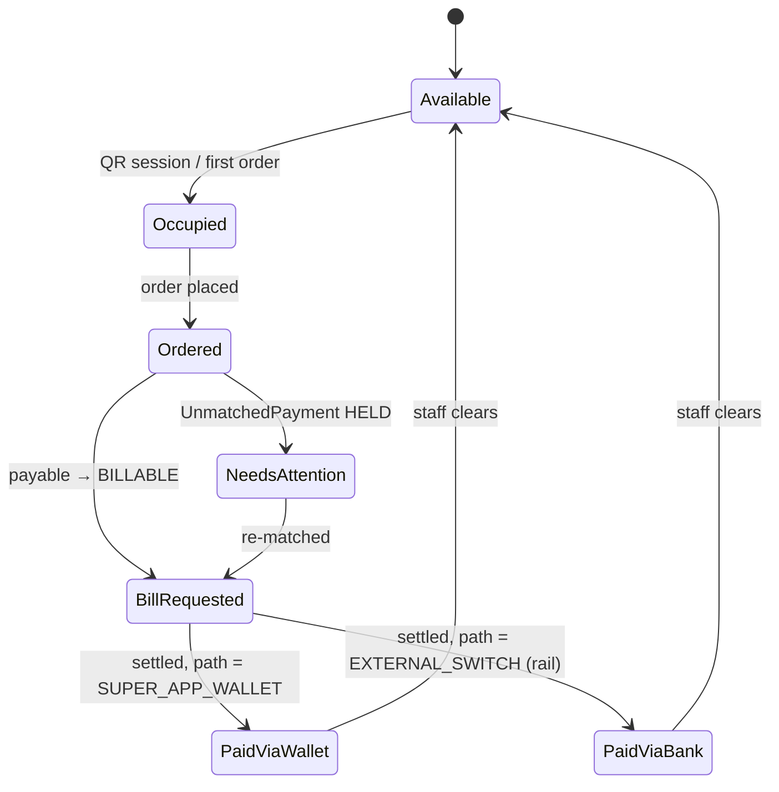

# Super App Mini-App Payments — Design

**Date:** 2026-08-20
**Status:** Approved design. Not yet planned or implemented.
**Scope:** sub-project 1 of 5 (payment core), with the boundaries of the other four
fixed well enough that none of them requires reopening this one.

---

## 1. Context

QRServe today does table scanning, ordering, kitchen dispatch and waiter requests.
Guests reach a signed menu URL from a printed table QR, orders flow through
`order-service`, and realtime updates fan out over STOMP through
`notification-service`. What does not exist: payments, non-table fulfilment, any
merchant-level configuration, and any Super App container integration.

This design adds payment capture and reconciliation across two payment paths,
inside a Super App ecosystem, without the platform ever holding funds.

### 1.1 What is already in the codebase

| Piece | State before this work |
|---|---|
| Table QR | Signed menu **URL** rendered to PNG by ZXing (`QrGeneratorService`). Not EMVCo. |
| Payments | Two unused columns on `OrderEntity`: `paymentMethod` (`PAY_AT_COUNTER`), `paymentStatus` (`UNPAID`). No service, no gateway client, no webhook. |
| Order lifecycle | `PENDING → ACCEPTED → PREPARING → READY → DELIVERED → PAID`, terminal at `PAID`/`CANCELLED`, guarded in `OrderStatus.allowedNext()`. |
| Bill request | `REQUEST_BILL` exists only as a waiter alert. It moves no state. |
| Table state | `AVAILABLE`, `OCCUPIED`, `RESERVED`, set from `order-service`. |
| Realtime | STOMP/SockJS → `notification-service`, Kafka domain events, Redis fan-out, anonymous order-stream token, guest status poll. |
| Mini-app container | Nothing. No WebView, bridge or `postMessage` code anywhere. |
| Merchant configuration | Nothing. `MerchantEntity` has no settings, and no settings entity exists in any service. |
| Table QR, frontend | `qrApi` and `useTableQr` exist, but `QRDesigner` renders the code **client-side** (`QRCode.toCanvas` from the `qrcode` package) and falls back to a fabricated `https://qrserve.com/menu/${slug}/${branchId \|\| 1}/${tableId \|\| 1}`. Table creation never surfaces a QR. |
| Per-table QR persistence | `TableEntity.qr_token` only. No stored payload, version, profile or printed-at — and therefore **no terminal-to-table mapping**. |
| Non-table orders | Impossible. `tableId` is `@NotNull` in `CreateOrderRequest` and `nullable = false` in `OrderEntity`. |

### 1.2 Decomposition

| # | Sub-project | Depends on |
|---|---|---|
| **1** | **Payment core — this document** | — |
| 2 | Interoperable QR provisioning: EMVCo rendering, provisioning profiles, reprint | 1 |
| 3 | Path B inbound: switch webhook adapter, verifier, operator tooling for held payments | 1 |
| 4 | Mini-app delivery: guest surface into a hosted Next.js app, shared package, Ant adapters, mini-program shell | 1 |
| 5 | Delivery fulfilment: addresses, zones, fees, dispatch, `OUT_FOR_DELIVERY` | 1, 4 |
| 6 | Non-table fulfilment: takeout customer surface, branch entry, contact capture, pickup queue (section 9) | 1 |

Sub-project 1 defines the models, ports and rules the others plug into. Sections
5–8 below specify the contracts those sub-projects must satisfy, so implementing
them is additive rather than a revision of this design.

---

## 2. Decisions register

| Decision | Choice | Consequence |
|---|---|---|
| External contracts (QR API, host bridge, switch webhook) | **No specs available — design against ports** | Every external surface is an adapter behind a port we own, with a dev fake and one contract-test suite. |
| Settlement timing | **Both prepaid and tab, merchant-configurable** | One payable, one state machine, one policy switch on the close trigger. Not two implementations. |
| QR amount | **Static amount-less sticker plus dynamic amount-bearing payload on demand** | The path carrying verifiable money is the dynamic one; the sticker is identity. |
| Funds custody | **Never ours. Always the merchant's own account** | No ledger, no payouts, no float, no money-transmitter exposure. We observe, verify, reconcile. |
| Fulfilment types | **Model all three; build dine-in and takeout** | `DELIVERY` is a valid enum the merchant cannot yet enable. No payment rework when it lands. |
| Container | **Ant/mPaaS, hosted Next.js page, both H5 and mini-program web-view in use** | Three host adapters behind one port; a mini-program shell becomes a maintained component. |

### 2.1 Where the payable lives, and why

The payable is a package inside **`order-service`** (`com.qrserve.order.payment`)
with its own tables and its own transaction boundary — extractable to a service of
its own the moment payments have a consumer beyond dining.

Two reasons this beat a separate `payment-service`:

1. **A bill total is the sum of order totals**, and order totals live in
   `OrderEntity.totalAmount` in this service. A separate service needs a
   projection, which duplicates money math across a service boundary. This
   codebase has already been burned twice by duplicated derivations: the QR URL
   construction that drifted between `qr-service` and `merchant-service` while each
   carried a comment claiming it matched the other, and `OrderStatus` drifting from
   the backend in four places. Duplicated *money* math is the worst version of that
   bug.
2. **Settling a bill and moving its orders to `PAID` happen in one transaction.**
   Eventual consistency here means a window where the guest has paid and the table
   still reads unpaid, and that window is exactly where double payments and
   duplicate cash collection happen.

The payment package never writes to `orders`. Status changes go through
`OrderService`'s existing transition guard.

---

## 3. Merchant configuration

Owned by **`merchant-service`**, which already owns `MerchantEntity` and
`BranchEntity`. Splitting settings elsewhere would split ownership of the merchant.

```
MerchantSettings
  merchantId (PK), branchId?            // null = merchant-wide default
  fulfilmentEnabled : Set<FulfilmentType>
  settlementMode    : Map<FulfilmentType, PREPAID | TAB>
  settlementProfile : { rail, destinationRef, credentialHandle, currency }
```

`rail` is one of `MPESA_COLLECTION`, `BANK_MAI`, `SUPER_APP_MERCHANT`.

**Settlement mode is keyed per (merchant × fulfilment type)**, not per merchant.
One restaurant commonly runs takeout prepaid and dine-in on a tab at the same time;
a scalar flag cannot express that.

**Credentials never live in this row.** `credentialHandle` is a reference resolved
at call time from the existing secret store. The M-PESA collection account's
credentials must not sit in a merchant table that admin endpoints can read.

**`order-service` reads settings through Redis**, reusing the pattern already
proven for tenant resolution: read-through cache with hit and miss TTLs
(`TenantCacheKeys` shape, new key namespace), invalidated by `merchant-service` on
write, falling back to a direct read when the cache is unavailable. Negative
caching matters — a merchant with no settings row is the common case early on and
must not become a database round trip per order.

---

## 4. The payable

### 4.1 Model

```
FulfilmentContext
  type      : DINE_IN | TAKEOUT | DELIVERY
  tableId?  : Long          // DINE_IN only; the signed QR proves presence
  pickupAt? : Instant       // TAKEOUT
  dropoff?  : DeliveryRef   // DELIVERY (sub-project 5)

Payable
  id, merchantId, branchId
  fulfilment          : FulfilmentContext
  mode                : PREPAID | TAB              // SNAPSHOT at open
  state               : OPEN | BILLABLE | SETTLED | ABANDONED
  expectedAmount?     : BigDecimal                 // set when BILLABLE
  currency            : String
  paymentRef          : String  UNIQUE             // ours; embedded in dynamic QR
  settlementSnapshot  : { rail, destinationRef }   // SNAPSHOT at open
  sessionRef?         : String                     // dine-in table session (see 4.5)
  openedAt, billableAt?, settledAt?
  version                                          // optimistic lock

PayableOrder            payableId × orderId        // join table owned by this package

InboundPaymentReceipt                                // the dedupe ledger
  externalRef  UNIQUE PRIMARY                        // one row per inbound payment, ever
  rail, amount, currency, receivedAt
  outcome     : SETTLED_ATTEMPT | HELD_UNMATCHED | IGNORED_FAILED
  attemptId?, unmatchedId?                           // exactly one is set
  rawPayload

PaymentAttempt
  id, payableId
  idempotencyKey  UNIQUE
  path            : SUPER_APP_WALLET | EXTERNAL_SWITCH | MANUAL_CASH
  rail, amount, currency
  externalRef?    UNIQUE when present
  state           : INITIATED | AUTHORIZED | SETTLED | FAILED | EXPIRED
  actorUserId?                                     // MANUAL_CASH only
  rawPayloadRef?, createdAt, updatedAt

UnmatchedPayment
  id, receivedAt, rail
  externalRef  UNIQUE
  amount, currency, claimedMerchantId?, claimedTerminal?
  reason : NO_OPEN_PAYABLE | AMBIGUOUS | AMOUNT_MISMATCH
         | UNKNOWN_TERMINAL | DUPLICATE_REF | LATE_AFTER_SETTLED
  state  : HELD | RESOLVED | REJECTED | REFUND_REQUESTED
  resolvedPayableId?, rawPayload
```

### 4.2 State machine



`mode` and `settlementSnapshot` are **snapshotted at open and never read live**. A
merchant flipping prepaid to tab, or changing their M-PESA account mid-meal, must
not change the rules underneath a guest already ordering — and a webhook arriving
after that change must still reconcile against the account actually presented on
the QR.

### 4.3 Prepaid gates the kitchen without a new order status

A prepaid order must not reach the kitchen board before it is paid. The kitchen
query excludes orders whose payable is not `SETTLED`.

Rejected alternative: an `AWAITING_PAYMENT` value on `OrderStatus`. That enum has a
frontend mirror (`ORDER_STATUS`), a rank table, progress steps, kitchen columns and
waiter filters, and four real bugs in this repo already came from it drifting. One
query change in one place beats a value that ripples through six call sites.

### 4.4 Amount policy

Split payments are out of scope, so:

- **Underpayment does not settle.** Held as `AMOUNT_MISMATCH` for staff.
  Auto-settling a short payment silently gives away food.
- **Overpayment settles** and flags for out-of-band refund. Refusing money the
  guest has already sent strands them at the table.

### 4.5 The dine-in session boundary

`sessionRef` opens when a signed table QR is first scanned or the first order is
placed at an `AVAILABLE` table, and closes when staff clear the table. It exists so
that a new party seated at the same table cannot join the previous party's tab: a
payable belongs to one `sessionRef`, and a table can hold at most one payable that
is not `SETTLED` or `ABANDONED`. Clearing a table closes the session and abandons
any payable still `OPEN` or `BILLABLE`.

---

## 5. QR provisioning

### 5.1 One builder, one place

The EMVCo payload builder lives in **`shared:common`** beside `PublicMenuUrl`, as a
pure static function with golden-vector tests. A drifted payment payload is a QR
that every bank app silently rejects, and this codebase has already shipped a
drifted URL builder.

### 5.2 Tag mapping (EMVCo merchant-presented mode)

| Tag | Static sticker | Dynamic (per bill) | Source |
|---|---|---|---|
| `00` payload format | `01` | `01` | constant |
| `01` point of initiation | `11` static | `12` dynamic | provisioning kind |
| `26`–`51` MAI template | rail + `destinationRef` | same | `settlementProfile` |
| `52` MCC | merchant category | same | merchant |
| `53` currency | `230` (ETB) | same | `settlementProfile.currency` |
| `54` amount | **absent** | `expectedAmount` | payable |
| `58` country | `ET` | same | constant |
| `59`, `60` name, city | merchant | same | merchant |
| `62-01` bill number | — | `payableId` | payable |
| `62-03` store label | branch ref | branch ref | branch |
| `62-05` reference label | — | **`paymentRef`** | payable — the reconciliation key |
| `62-07` terminal label | `tableId` | `tableId` (dine-in) | table |
| `81` unreserved | GUID + mini-app context | GUID + `payableId` | ours |
| `63` CRC | computed | computed | CRC-16/CCITT-FALSE |

**Every minted payload is parsed back and CRC-verified before it is shown or
printed.** A bad CRC fails silently inside the guest's bank app and is unfixable in
the field.

### 5.3 The sticker is EMVCo — an unavoidable either/or

A TLV payload is not a URL, so one code cannot serve both a generic phone camera
(to the menu) and a generic bank app (to payment).

Decision: **the sticker carries the EMVCo payload.** It works with every bank app
today with zero host cooperation, and Path B is the path we cannot change later.
Mini-app entry then comes from the Consumer Super App's scanner once it reads tag
`81`'s GUID — a requirement filed against that port — with the interim entry being
the app's merchant directory. Today's signed-URL QR remains available as a second
printable code for merchants who want camera-to-menu.

Both are **provisioning profiles behind one port**, so if the host team declines
the scanner change, this becomes configuration rather than a rewrite.

### 5.4 Port

```ts
type QrKind = 'STATIC' | 'DYNAMIC';

interface QrPayload {
  raw: string;             // EMVCo TLV
  kind: QrKind;
  paymentRef?: string;     // DYNAMIC only
  expiresAt?: string;      // ISO; DYNAMIC only
}

interface QrPayloadPort {
  mintStatic(table: TableRef): Promise<QrPayload>;                       // cached, reprint-stable
  mintDynamic(payable: PayableRef, amount: Money): Promise<QrPayload>;   // single-use, TTL-bound
}
```

The dev fake **is** the local EMVCo renderer: deterministic and fully testable. The
adapter for the external QR Generation API drops in behind the same port, with
contract tests asserting identical parsed tags rather than identical strings.

**We must not depend on `62-05` coming back.** Whether the switch echoes the
reference label into its webhook is the largest unknowable without specs, so the
matcher has a reference-free path. Static stickers carry no reference at all —
which is why dynamic payloads carry the money that matters.

### 5.5 Table binding and the terminal mapping

A table QR is provisioned when the table is created, and the exact bytes are stored:

```
TableQr                                  // static stickers only; dynamic payloads are
                                         // per-bill and never stored here
  id, tableId, merchantId, branchId
  terminalLabel : String  UNIQUE         // tag 62-07 — unique PER VERSION (see below)
  payloadRaw    : String                 // the exact bytes that went onto the sticker
  payloadCrc    : String
  profile       : EMVCO | MENU_URL       // the two provisioning profiles from 5.3
  version       : int
  state         : ACTIVE | SUPERSEDED | REVOKED
  provisionedAt, printedAt?, supersededAt?
```

**This is a payment-core dependency, not presentation work.** The `UNKNOWN_TERMINAL`
outcome in 6.3 and the rule in 6.4 that the anonymous webhook derives its merchant
from our own terminal mapping both require this table. `TableEntity.qr_token` is not a
substitute: it carries no payload, no version and no resolvable terminal label.

- **Provisioned inside the table-creation flow.** A table cannot exist without a
  scannable code, and the creation response returns the rendered image.
- **The stored payload is the truth.** A payment instrument in the physical world is a
  liability; "what exact bytes are on table 15" must be answerable without recomputing
  and hoping the inputs have not changed.
- **Reprint creates a new version with a new `terminalLabel`, and the old row becomes
  `SUPERSEDED`, never deleted.** A sticker can stay on a table for weeks after a
  rotation, so the matcher resolves `terminalLabel` to a table across `ACTIVE` and
  `SUPERSEDED` rows alike. Deleting them would silently convert real payments into
  `UNKNOWN_TERMINAL` held records. The label changing per version is deliberate: it
  makes a payment traceable to the physical sticker that produced it, which is how you
  find out a stale code is still in circulation.
- **`REVOKED`** is for a sticker known destroyed or compromised. Payments quoting it
  are held, never settled.
- A **branch-level entry QR** (section 9.2) is provisioned with the `MENU_URL` profile,
  not `EMVCO`: without a table there is no terminal and without a bill there is no
  amount, so there is nothing to pay.

### 5.6 Rendering rule, and a bug to delete

**The server renders the image; the client never renders the payload.** `QRDesigner`
currently draws the code itself with `QRCode.toCanvas` — a second renderer for what is
about to become a money instrument, which is the drift class this codebase has already
paid for twice, now with a CRC attached. The designer composes branding *around* a
server-provided image.

**Delete the fabricated fallback.** `QRDesigner` falls back to
`https://qrserve.com/menu/${slug}/${branchId || 1}/${tableId || 1}` when metadata has
not loaded — the wrong domain (the tenant scheme is `{merchant}.qrserve.safaricom.et`)
with branch and table defaulted to `1`. A merchant can print and laminate that, and
nobody discovers it until a guest scans it. No metadata means an empty state, never a
guess.

---

## 6. Payment paths

Both paths converge on one canonical ingest, so they cannot drift:

```ts
type PaymentRail =
  | 'MPESA' | 'TELEBIRR' | 'CBE_BIRR' | 'AMOLE'
  | 'CARD' | 'SUPER_APP_WALLET' | 'OTHER';

interface InboundPayment {
  eventId: string;
  rail: PaymentRail;
  externalRef: string;                            // switch/wallet txn id — dedupe key
  amount: { value: string; currency: string };    // decimal string
  claimedMerchantId?: string;                     // DATA, never authorization
  claimedTerminal?: string;                       // tag 62-07 → tableId
  referenceLabel?: string;                        // tag 62-05 → paymentRef
  billNumber?: string;                            // tag 62-01
  payerAlias?: string;                            // masked
  occurredAt: string;                             // ISO, claimed by the sender
  receivedAt: string;                             // ISO, ours — authoritative for windows
  status: 'SUCCESS' | 'FAILED' | 'REVERSED';
  raw: unknown;                                   // persisted for audit and replay
}
```

### 6.1 Path A — Super App wallet via the JS bridge



### 6.2 Path B — external bank or wallet app



### 6.3 Matcher cascade

Evaluated in order. Step 1 always runs first.

1. **Dedupe** on `externalRef` against `InboundPaymentReceipt` — a single ledger
   with one row per inbound payment, so a replay returns the *recorded* outcome
   whether the original settled or was held. Dedupe must not be a lookup across two
   tables; one unique key, one answer, never a second settle.
2. **Reference match**: `referenceLabel` (or `billNumber`) resolved to `paymentRef`.
3. **Reference-free fallback**: candidates are payables for that merchant and
   terminal, in `OPEN` or `BILLABLE`, with `receivedAt` inside the session window.

| Reference | Candidate state | Amount vs expected | Outcome |
|---|---|---|---|
| matched | `BILLABLE` | equal | **SETTLE** |
| matched | `BILLABLE` | less | `AMOUNT_MISMATCH` held |
| matched | `BILLABLE` | greater | **SETTLE** plus refund flag |
| matched | `SETTLED` | any | `LATE_AFTER_SETTLED` held (refund candidate) |
| matched | `ABANDONED` | any | `NO_OPEN_PAYABLE` held |
| absent | exactly one `BILLABLE` | equal | **SETTLE** |
| absent | exactly one `BILLABLE` | not equal | `AMOUNT_MISMATCH` held |
| absent | exactly one `OPEN` | equals running total | **close tab, then SETTLE** |
| absent | exactly one `OPEN` | anything else | `AMOUNT_MISMATCH` held |
| absent | more than one | any | `AMBIGUOUS` held |
| absent | none | any | `NO_OPEN_PAYABLE` held |
| — | terminal not mapped | any | `UNKNOWN_TERMINAL` held |

The `OPEN` plus running-total row is not an edge case: guests routinely pay before
asking for the bill.

Money never disappears and the platform never auto-refunds, because it never holds
funds. Every non-settling outcome is a `HELD` record surfaced to staff.

### 6.4 Webhook handling

- **Accept, verify, persist raw, return `200`, then process asynchronously.**
  Switches retry on slow responses and the gateway's time limiter is 10s;
  synchronous matching would turn one payment into several retried deliveries.
- Duplicate delivery is normal traffic, not an error.
- `HELD` payments are re-matched on **every** payable transition into `BILLABLE`,
  plus a periodic sweep, so the webhook-before-bill-closed race self-heals.
- Windows use **our** `receivedAt`; `occurredAt` is a claim. Switch settlement can
  lag minutes, so windows are generous and overlap is resolved by amount.
- Verification is a `WebhookVerifier` port; the dev fake is shared-secret HMAC.
- The endpoint is anonymous, so the merchant is derived from our own
  **terminal-to-table mapping** (5.5), never from `claimedMerchantId`.
- An unverified webhook returns `401` **and raises an alert**. It is either a
  misconfiguration or an attack, and silently dropping it loses money either way.

### 6.5 The client callback is a hint, never authority

`onPaymentEvent` moves the UI to "Confirming…"; only the server-side webhook
settles. The mini-app runs on the guest's device, so trusting the bridge callback
would let a tampered WebView mark bills paid.

---

## 7. Ports, the JS bridge, and host adapters

The mini-app runs in an Ant H5/Nebula container, inside a native mini-program
`<web-view>`, and as a plain browser or installed PWA. One port; adapters chosen by
**capability probe, never user-agent sniffing**.

```ts
type FulfilmentType = 'DINE_IN' | 'TAKEOUT' | 'DELIVERY';

interface HostCapabilities {
  bridgeVersion: string;
  wallet: boolean;
  scanner: boolean;
  geolocation: boolean;
  merchantContext: boolean;
}

/** CLAIMS from the host. Prefill only — never trusted for authorization. */
interface MerchantContextClaim {
  merchantId?: string;
  branchId?: number;
  tableId?: number;
  qrRaw?: string;              // scanned payload incl. HMAC signature — the actual proof
  fulfilmentHint?: FulfilmentType;
}

/** Decimal string, never a JS number. */
interface Money { value: string; currency: string }

interface PaymentRequest {
  intentId: string;            // OURS — created by our backend before the bridge is called
  hostTradeRef: string;        // THEIRS — the wallet's trade number; what the cashier takes
  payableId: string;
  amount: Money;
  paymentRef: string;
  qrPayload?: string;          // dynamic EMVCo, for hosts that pay by payload
  idempotencyKey: string;
  description?: string;
}

type PaymentOutcome =
  | { status: 'AUTHORIZED'; hostTxnRef?: string }
  | { status: 'FAILED'; code: string; message?: string }
  | { status: 'CANCELLED' }
  | { status: 'UNKNOWN' };     // sheet dismissed / no callback / timeout / transport loss

interface HostPort {
  capabilities(): Promise<HostCapabilities>;
  getMerchantContext(): Promise<MerchantContextClaim>;
  requestPayment(req: PaymentRequest): Promise<PaymentOutcome>;
  onPaymentEvent(cb: (e: PaymentOutcome & { intentId: string }) => void): () => void;
  coarseLocation?(): Promise<{ lat: number; lng: number; accuracyM: number } | null>;
}
```

### 7.1 `UNKNOWN` is a first-class outcome

Native cashier sheets get dismissed and fire nothing. Treating silence as failure
tells a guest their payment failed while their money is moving. `UNKNOWN` means
*ask the server*, and the server is already the authority.

The Ant cashier returns a synchronous client result **and** an asynchronous server
notify, with the notify authoritative — the same split this design already
requires. Client result mapping, **to be confirmed against your container build**:

| Client result | `PaymentOutcome` |
|---|---|
| `9000` success | `AUTHORIZED` (still not settled) |
| `8000` processing | `UNKNOWN` |
| `6004` unknown result | `UNKNOWN` |
| `6002` network error | `UNKNOWN` |
| `6001` user cancelled | `CANCELLED` |
| `4000` failed | `FAILED` |

Treating `8000` as failure is the classic bug in this integration.

### 7.2 Adapters

| Runtime | Bridge | Payment initiation |
|---|---|---|
| H5 / Nebula loads our URL | `window.AlipayJSBridge` | `AlipayJSBridge.call('tradePay', { tradeNO })` |
| Mini program embeds our URL in `<web-view>` | **none** | `my.postMessage` → our mini-program shell → `my.tradePay` → result via `my.onMessage` |
| Browser or installed PWA | none | render the dynamic EMVCo payload on screen (Path B on the guest's own device) |

```ts
class AntH5Host implements HostPort {
  private ready = new Promise<void>((resolve) => {
    // MUST check first: the event may already have fired before our bundle ran.
    if ((window as any).AlipayJSBridge) return resolve();
    document.addEventListener('AlipayJSBridgeReady', () => resolve(), false);
  });

  private call<T>(api: string, params: object, timeoutMs = 60_000): Promise<T> {
    return this.ready.then(() => new Promise<T>((resolve, reject) => {
      const t = setTimeout(() => reject(new BridgeTimeout(api)), timeoutMs);
      (window as any).AlipayJSBridge.call(api, params, (r: T) => {
        clearTimeout(t);
        resolve(r);
      });
    }));
  }

  async requestPayment(req: PaymentRequest): Promise<PaymentOutcome> {
    try {
      const r = await this.call<{ resultCode: string }>('tradePay', { tradeNO: req.hostTradeRef });
      return mapAntResult(r.resultCode);
    } catch {
      return { status: 'UNKNOWN' };      // a timeout is never a failure
    }
  }
}
```

A hosted page inside a mini-program `<web-view>` **cannot reach the cashier
itself**: that transport is asynchronous with no return values. It needs a thin
mini-program shell that we own and maintain, plus a correlation layer (`requestId`
out, `requestId` back, timeout to `UNKNOWN`). That shell is a maintained component,
not an afterthought.

### 7.3 Identity and location inside the container

- `getAuthCode` yields a real wallet user identity (authCode exchanged
  server-side), which is strictly better than the anonymous order-stream token.
  Both are kept: wallet identity in-container, anonymous token in the plain
  browser.
- `getLocation` replaces browser geolocation in-container. It does **not** change
  the rule: location serves delivery address capture, zone eligibility and soft
  risk signalling, and is **never** an authorization gate. Browser geolocation is
  permission-gated, indoors-unreliable and trivially spoofable; in a WebView it is
  still client-supplied.
- Presence at a table is proven by the HMAC-signed QR (`QrSignatureService`).

### 7.4 Frontend restructuring (sub-project 4)

The container renders a hosted URL; **Next.js is a house pattern, not a technical
requirement**. It does buy a real win here — a server-rendered menu paints before a
Vite SPA has fetched its JS, on mobile data, at a table, which is the moment this
product lives or dies.

The guest surface **moves**; it is not copied. Three workspaces: a shared package
(types, API client, realtime client, `orderStatus`, `orderSession`, `HostPort`), the
Next.js guest mini-app, and the existing Vite app reduced to staff surfaces
(merchant, kitchen, waiter, admin). Copying would put money and status logic in two
frontends, which is the drift bug this repo has already paid for twice.

SSR note: `readTrackedOrder` reads `localStorage` and must stay inside an effect,
never running during render, or hydration mismatches. It already does.

PWA note: service workers are unreliable to unavailable inside these containers,
which have their own offline-package and versioning mechanism, and the container
enforces a **domain whitelist** — the gateway origin *and* the STOMP/SockJS
endpoint must both be listed, or realtime dies silently in-app while working
perfectly in a browser.

---

## 8. Realtime and state transitions

**STOMP is reused; no SSE.** `notification-service`, `StompDestinations`,
`StompAuthInterceptor`, the Redis fan-out and the reconnect-resync pattern already
exist and are tested. A second transport means a second auth path and a second
missed-message story.

Two new Kafka topics, following the existing one-topic-per-event-class style:
`payment-settled` and `payment-unmatched`, consumed by `DomainEventListener`.

| Destination | Audience |
|---|---|
| `/topic/payables/{payableId}` | the guest tracking a bill (a tab spans many orders) |
| `/topic/merchant/{m}/branch/{b}/payments` | staff cashier view: settlements and held payments |

Kitchen and waiter topics are untouched: a kitchen board does not need settlement
traffic, and the waiter topic is for guest requests. Guest access to the payable
topic extends the existing anonymous token with a `payableId` claim, so
`StompAuthInterceptor` permits exactly the order and payable named in the token —
same pattern, one more claim, no new token type.

### 8.1 The table lifecycle is a view-model, not an enum

`TableStatus` stays `AVAILABLE`, `OCCUPIED`, `RESERVED` — occupancy only.
`BILL_REQUESTED` and `PAID` live on the payable, where they already are. The
merchant board composes its display state:



Persisting these as table statuses would put one truth in two enums that can drift
— the failure this codebase has already paid for twice. "Paid via Telebirr" is then
real data off the settling attempt's `rail`, not a status name someone must
remember to add when a new wallet appears.

Clearing a table is a staff action: occupancy to `AVAILABLE`, and any still-`OPEN`
payable is abandoned. A settled payable makes clearing pure occupancy. Takeout and
delivery have no table and render as a fulfilment queue on the same merchant
destinations.

**Push is not authoritative.** The payable topic gets the same treatment as order
status: a polled read as the source of truth, invalidated by pushes and refetched
on reconnect.

---

## 9. Non-table fulfilment: the customer surface

Everything guest-facing today is table-derived. Takeout is built in this phase;
delivery is modelled only (section 2).

### 9.1 What breaks without a table

| Breaks | Fix |
|---|---|
| `resolveMenuTarget` requires a table number; resolution is merchant + branch + table | A branch-only form (9.2). It must keep rejecting a missing table for `DINE_IN`, so a dine-in order can never be placed without one |
| The signed table QR is the presence proof; takeout has none | It needs none — prepaid is the control (9.3) |
| No customer contact: `customerName` is optional and there is no phone | `CustomerContact` (9.4) |
| The tracked-order record scopes on `merchantId + tableId` | Scope becomes `merchantId + fulfilmentType + (tableId \| 'TAKEOUT')` (9.5) |
| No handover step; `DELIVERED` is written from the kitchen board | Pickup queue with a staff handover action (9.4) |
| `ServiceDock` offers call-waiter, water and bill | Rendered only for `DINE_IN` (9.5) |
| `OrderProgress`'s final step reads "Served" | Fulfilment-aware labels (9.5) |
| No promised time is shown | Surface the existing `estimatedTime` as a pickup ETA (9.5) |

### 9.2 Entry point

A branch-level route `/{merchantSlug}/{branchSlug}` with no table segment, reached from
a branch entry QR (`MENU_URL` profile, see 5.5) or the Super App merchant directory.
`resolveMenuTarget` gains a branch-only form; the dine-in form is unchanged and still
refuses a missing table number, so widening the entry cannot weaken table ordering.

### 9.3 Presence, and why takeout needs no proof

Dine-in presence is proven by the HMAC-signed table QR. Takeout has no table and needs
no equivalent, because **prepaid is the control**: the kitchen never sees an unpaid
takeout order (4.3), so an abusive unpaid order costs a database row and nothing else.
This is exactly why settlement mode is keyed per fulfilment type (section 3) rather
than per merchant — takeout being prepaid is a security property, not a preference.

### 9.4 Contact and handover

```
CustomerContact { name, phone, walletUserRef? }
```

Required for `TAKEOUT` and `DELIVERY`, optional for `DINE_IN`. In-container,
`getAuthCode` supplies `walletUserRef` and the wallet profile prefills name and phone
(7.3).

Handover: `READY` → guest notified → guest arrives → staff confirm → `DELIVERED`. The
**order number is the pickup code**; a second code would be one more thing to lose.
For takeout, `DELIVERED` is written by the pickup-queue action, not by the kitchen
board — the kitchen finishing the food and a human receiving it are different events,
and conflating them is how "picked up" orders sit uncollected on a counter.

### 9.5 Fulfilment-aware guest UI

- **Tracked-order scope** becomes `merchantId + fulfilmentType + (tableId | 'TAKEOUT')`.
  The current record keys on merchant and table, so a takeout order would be dropped on
  every refresh.
- **`ServiceDock` renders only for `DINE_IN`.** Call-waiter, water and bill are
  meaningless at a pickup counter.
- **`OrderProgress` final step label follows the fulfilment type**: Served, Picked up,
  or Delivered. The step ladder itself is unchanged.
- **Pickup ETA** comes from `estimatedTime`, already returned by the create response.

### 9.6 Merchant surface

Takeout and delivery have no table, so they render as a **fulfilment queue** on the
existing merchant destinations (section 8) rather than a table board: awaiting payment
(prepaid), in kitchen, ready for pickup, handed over. The table board stays dine-in
only, as in 8.1.

---

## 10. Invariants, failure modes, security

### 10.1 Invariants, each with a mechanism

| Invariant | Enforced by |
|---|---|
| At most one settled payment per payable | partial unique index `(payableId) where state = 'SETTLED'` plus `@Version` on `Payable` |
| Every inbound payment is matched or held, never dropped | `externalRef` unique plus `UnmatchedPayment` as the mandatory else-branch |
| A payable never settles below `expectedAmount` | matcher holds `AMOUNT_MISMATCH` |
| No order reaches `PAID` without a settled attempt | settle is the only caller of the `PAID` transition |
| The platform never auto-refunds | it holds no funds; refunds are surfaced, never actioned |

Double payment is prevented **in the database**, not in application code. When a
Path A wallet notify and a Path B switch webhook land for the same bill
simultaneously, exactly one wins; the loser is recorded as
`UnmatchedPayment(DUPLICATE_REF)`. Application-level checks lose that race; a
unique index cannot.

### 10.2 Cash is the most likely way invariant 4 gets broken

A guest pays in-app while a waiter collects cash, and the cash never touches the
payable — so the bill still looks open and the wallet payment settles something
already collected. **"Mark paid by cash" must create a
`PaymentAttempt(path = MANUAL_CASH, actorUserId = …)` through the same settle
path.** Any side channel that flips an order to `PAID` outside the payable breaks
the model, and this is where someone will add one.

### 10.3 Security

- `credentialHandle` only — never credentials — in `MerchantSettings`.
- Raw payloads carry payer identifiers: retention limits and restricted access.
- Amounts are `BigDecimal` end to end and decimal strings on the wire. A JS float
  in a payment amount is a rounding bug waiting for a busy Friday.
- QR payloads and stream tokens are never logged; the stream token is a bearer
  capability.
- Dynamic payloads are single-use and TTL-bound; replay after settle is
  `LATE_AFTER_SETTLED`.
- A sticker physically moved to another table cannot cause a loss — it carries no
  amount, so the worst case is `AMBIGUOUS` or `HELD`, not a wrong settlement.
- The public payable-status endpoint uses the same token-scoped access as the guest
  order endpoint, plus rate limiting.
- Cross-tenant access is already handled by the gateway's `X-Tenant-Id` precedence
  and `TenantContextFilter`; the anonymous webhook derives its merchant from the
  terminal mapping.

### 10.4 Testing

| Level | Coverage |
|---|---|
| Unit | payload builder golden vectors **including CRC**; the matcher truth table (6.3) row by row; every state-machine transition and every rejected transition |
| Concurrency | Path A notify and Path B webhook fired at one payable: exactly one settle, loser held |
| Integration | webhook before `BILLABLE`, held, then re-matched on close; duplicate delivery returns the original outcome; underpayment held; late-after-settled |
| Contract | one suite against `FakeHost` in CI and the real container in staging; `QrPayloadPort` adapters compared on **parsed tags**, not strings; `WebhookVerifier` fakes |

`FakeHost` scripts every outcome including `UNKNOWN` and slow authorization. New
pure frontend logic follows the existing `tsx` harness style rather than
introducing a test runner. Java suites run with `./gradlew test`.

---

## 11. Open items

1. **Real external specs.** The QR Generation API, the container's actual bridge
   surface, and the switch's webhook and verification scheme are all unknown.
   Adapters and contract tests are written against fakes; the Ant result-code
   mapping in 7.1 needs confirming against your container build.
2. **Host scanner requirement.** Reading tag `81`'s GUID to route into the mini-app
   must be filed against the Consumer Super App team. If declined, the fallback is
   the second printable URL code plus merchant-directory entry.
3. **Whether `62-05` survives the switch round trip.** Determines how much traffic
   takes the reference-free path.
4. **Container domain whitelist** must include the gateway origin and the
   STOMP/SockJS endpoint.
5. **Next.js migration scope** (sub-project 4) is larger than an adapter: it is a
   workspace split.
6. **Whether branch entry QRs get printed at all**, or takeout entry is Super App
   directory only. Decides whether 5.5's `MENU_URL` branch provisioning ships with
   sub-project 6 or is deferred.

## 12. Out of scope

Split and partial payments; any double-entry ledger; platform custody, payouts,
fees or settlement scheduling; refund execution; delivery zones, fees, dispatch and
`OUT_FOR_DELIVERY` (sub-project 5); loyalty, tipping and promotions.
